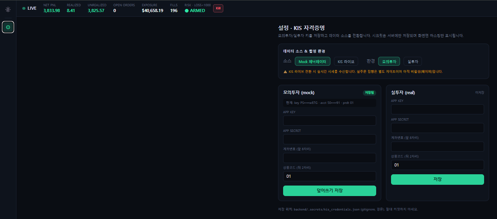

# money-py

**AI 기반 실시간 미국주식 스캘핑 인프라**

> 📌 이 저장소는 프로젝트 **개요·아키텍처·스크린샷**만 공개합니다.
> 실제 소스코드는 비공개(private) 저장소에서 관리됩니다.
> 연구·실험 단계 프로젝트이며, 투자 권유가 아닙니다.

---

## 한눈에 보기

한국투자증권(KIS) Open API로 미국 주식 실시간 호가/체결을 수집하고, 머신러닝으로
단기 가격 움직임을 예측해 **지정가 "거미줄(grid)" 매매**로 통계적 우위(EV>0)를 탐색하는
풀스택 트레이딩 인프라입니다. 수집부터 추론·실행·모니터링·백테스트까지 엔드투엔드로
직접 설계·구현했습니다.

## 핵심 전략

- **시장가 없는 maker-only 거미줄.** 모든 진입/청산을 best_bid 이하 여러 레벨에 지정가로
  깔아(거미줄) 수수료·슬리피지를 구조적으로 방어한다. 시장가 주문을 일절 쓰지 않는 것이 전략 정체성.
- **트리플 배리어 라벨링** (López de Prado, *Advances in Financial Machine Learning*).
  상단·하단·시간 3개의 배리어 중 무엇을 먼저 터치하는지로 라벨링해 **미래 정보 누수를 차단**한다.
- **EV 게이트.** 모델 확률 `p`가 손익분기 확률을 넘고 기대값이 양수일 때만 진입:

  ```
  breakeven_p = (sl + fee) / (tp + sl)
  EV = p·tp − (1−p)·sl − fee − slippage   →   진입 조건: EV > 0
  ```

  수수료를 이기지 못하는 신호는 진입 자체를 차단한다.

## 피처 엔지니어링

Polars 기반으로 호가/체결 스트림에서 실시간 계산하는 마이크로구조 피처:

| 피처 | 의미 |
|---|---|
| 호가 불균형 (OBI) | best/depth 단계 매수·매도 잔량 불균형 |
| 호가벽 비율 | 매수 방어벽 대 매도벽 로그 비율 |
| 거래량 Z-Score | Polars rolling mean/std 기반 수급 가속도 |
| 단기 수익률 / 스프레드 | 모멘텀·체결 비용 |
| 피크/트로프 거리 | `scipy.signal.find_peaks`로 직전 고점·저점까지 거리 |

→ LightGBM `predict_proba` 추론 (프로세스 내 직접 호출, 네트워크 오버헤드 0).

## 누수 없는 검증 파이프라인

연구의 핵심은 "백테스트가 거짓말하지 않게" 만드는 것:

- **Purged train/test 분리 + embargo** — 라벨의 룩어헤드 구간을 학습/평가 경계에서 제거.
- **Walk-forward (anchored)** — 과거로만 학습하고 직후 미래 구간을 out-of-sample로 검증,
  이를 시간순으로 전진. 인-샘플 성과를 신뢰하지 않고 세션간 교차검증으로 과적합을 가려낸다.
- **Edge 해부 도구** — 모델 확신도·시간대·심볼별로 실현 수익을 분해해 우위의 원천을 추적.
- **보수적 체결 모델** — 백테스터는 maker 지정가 체결만 인정하고 큐/유동성 낙관을 경계.

## 아키텍처

```
KIS WebSocket ─► 수집기 ─► 링버퍼 ─► 피처엔진 ─► LightGBM ─► 거미줄전략 ─► EV게이트 ─► 실행엔진 ─► KIS REST
                  (mock 대체)  (deque)   (Polars)                                          (paper 대체)
                                            │
                          FastAPI 서빙 ◄────┴────► React 어드민 대시보드 (실시간 WS)
```

- **단일 asyncio 이벤트 루프** — 수집·추론·실행을 논블로킹으로 한 루프에서 처리,
  링버퍼(`deque(maxlen)`)로 락 없는 O(1) 적재.
- **프로세스 내 메모리 공유** — 수집→피처→추론→실행이 같은 메모리를 직접 참조해
  직렬화/네트워크 오버헤드 제거.
- **부품 교체 가능 설계** — 수집기(KIS↔mock)·브로커(실거래↔페이퍼)를 팩토리로 주입하고,
  **같은 의사결정 코어를 라이브와 백테스트가 공유**해 시뮬↔실전 괴리를 최소화.

자세한 다이어그램(데이터 흐름 + 연구 파이프라인)은 [docs/architecture.md](docs/architecture.md).

## 폴더 구조

```
backend/
  config/        pydantic-settings 중앙 설정 (KIS/수수료/유니버스/전략/리스크)
  src/
    core/        타입, 링버퍼
    collectors/  KIS 웹소켓 수집기 + mock 생성기
    features/    Polars 피처 엔지니어링 + 추론 파이프라인
    models/      LightGBM 추론 래퍼 (+ 휴리스틱 스텁 폴백)
    strategies/  거미줄 그리드 + EV 계산
    execution/   주문 상태머신, KIS 브로커, 페이퍼 브로커, 유량 제한
    risk/        포지션/노출/손실 한도 + 킬스위치
    app/         FastAPI 서버, 앱 상태, 자격증명 저장소
    backtest/    이벤트 리플레이 백테스터, 기록기, purged split
    training/    트리플 배리어 라벨링, LightGBM 학습
  scripts/       데모·진단·학습·백테스트·walk-forward·edge 분석 도구
frontend/        React + Vite + Tailwind 어드민 대시보드 (Cockpit 레이아웃)
docker-compose.yml   redis + backend + frontend (멀티스테이지, 헬스체크, 핫리로드)
```

## 운영 & 안전장치

- **무인 파이프라인** — 야간 자동 녹화 → 학습 → 백테스트 → 리포트까지 스케줄 기반 무인 실행.
- **거래소 제약 준수** — 계좌당 웹소켓 1세션, REST 유량 제한 페이서, 재접속·토큰 캐시.
- **실거래 다중 가드** — 명시적 플래그 없이는 실주문이 절대 실행되지 않음(기본은 페이퍼).
- **비밀키 격리** — 자격증명은 별도 저장소에 격리·마스킹, 응답/UI에 평문 노출 차단.
- **리스크 레이어** — 심볼/총 노출·동시 주문·진입 빈도·일일 손실 한도 + 킬스위치.

## 기술 스택

`Python 3.12` · `FastAPI` · `asyncio` · `Polars` · `LightGBM` · `scipy` · `Redis`
· `httpx` · `websockets` · `React` · `Vite` · `Tailwind` · `Docker`

## 스크린샷

| 대시보드 (Cockpit) | 설정 |
|---|---|
|  |  |

## 진행 상황

- ✅ 실시간 수집 → 추론 → 실행 → 모니터링 엔드투엔드 파이프라인
- ✅ 야간 무인 데이터 수집 및 자동 분석 파이프라인
- ✅ 백테스터 · walk-forward · edge 분석 도구
- 🔬 진행 중: 전략 우위(edge)의 out-of-sample 검증, 데이터 축적, 체결 모델 정교화

---

*This repository is documentation-only. Source code is kept in a private repository.*
