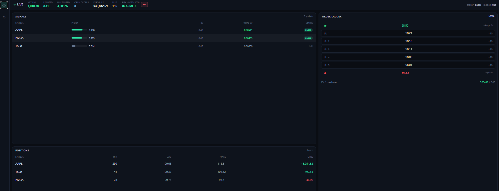

# money-py

**AI 기반 실시간 미국주식 스캘핑 인프라**

> 📌 이 저장소는 프로젝트 **개요·아키텍처·스크린샷**만 공개합니다.
> 실제 소스코드는 비공개(private) 저장소에서 관리됩니다.
> 연구·실험 단계 프로젝트이며, 투자 권유가 아닙니다.

---

## 한눈에 보기

한국투자증권(KIS) Open API로 미국 주식 실시간 호가/체결을 수집하고, 머신러닝으로
단기 가격 움직임을 예측해 **지정가 "거미줄(grid)" 매매**로 통계적 우위(EV>0)를 탐색하는
풀스택 트레이딩 인프라입니다.

- **데이터 수집** — KIS WebSocket 실시간 스트림 (체결/호가 10단계)
- **피처 엔지니어링** — Polars 기반 호가 불균형·거래량 Z-Score·피크 거리 등
- **예측 모델** — LightGBM, 트리플 배리어 라벨링
- **매매 전략** — 시장가 없이 지정가 maker-only로 수수료 방어, EV 게이트
- **실행/리스크** — 주문 상태머신, 유량 제한, 포지션·손실 한도 + 킬스위치
- **모니터링** — FastAPI + React 실시간 어드민 대시보드

## 아키텍처

```
KIS WebSocket ─► 수집기 ─► 링버퍼 ─► 피처엔진 ─► LightGBM ─► 거미줄전략 ─► EV게이트 ─► 실행엔진 ─► KIS REST
                                       (Polars)                                              
                                          │
                        FastAPI 서빙 ◄────┴────► React 어드민 대시보드 (실시간 WS)
```

단일 asyncio 이벤트 루프 + 프로세스 내 직접 메모리 접근으로 네트워크 오버헤드를 제거했습니다.
자세한 다이어그램은 [docs/architecture.md](docs/architecture.md) 참고.

## 핵심 설계 포인트

| 주제 | 접근 |
|---|---|
| 수수료 방어 | 시장가 배제, best_bid 이하 지정가 그리드(maker-only) |
| 라벨링 | 트리플 배리어(상단/하단/시간) — 미래 정보 누수 차단 |
| 검증 | purged train/test 분리 + embargo, **walk-forward** out-of-sample |
| 과적합 방지 | 인-샘플 성과를 신뢰하지 않고 세션간 walk-forward로 교차검증 |
| 무인 운영 | 야간 자동 녹화 → 학습 → 백테스트 → 리포트 파이프라인 |
| 안전장치 | 실거래는 다중 플래그 없이는 차단, 비밀키 마스킹·격리 |

## 기술 스택

`Python 3.12` · `FastAPI` · `asyncio` · `Polars` · `LightGBM` · `scipy` · `Redis`
· `httpx` · `websockets` · `React` · `Vite` · `Tailwind` · `Docker`

## 스크린샷

> 대시보드 캡처를 `screenshots/` 에 추가하세요.

| 대시보드 (Cockpit) | 설정 |
|---|---|
|  |  |

## 진행 상황

- ✅ 실시간 수집 → 추론 → 실행 → 모니터링 엔드투엔드 파이프라인
- ✅ 야간 무인 데이터 수집 및 자동 분석 파이프라인
- ✅ 백테스트·walk-forward·edge 분석 도구
- 🔬 진행 중: 전략 우위(edge)의 out-of-sample 검증, 데이터 축적

---

*This repository is documentation-only. Source code is kept in a private repository.*
