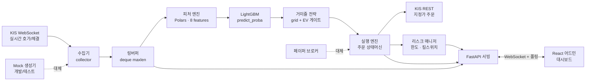
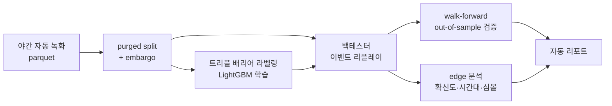

# 아키텍처

## 데이터 흐름

## 연구 파이프라인 (오프라인)

## 설계 원칙

- **단일 이벤트 루프** — asyncio 하나로 수집·추론·실행을 논블로킹 처리. 링버퍼(deque)로
  락 없는 고속 적재.
- **프로세스 내 메모리 접근** — 수집→피처→추론→실행이 같은 프로세스 메모리를 공유해
  네트워크/직렬화 오버헤드 제거.
- **부품 교체 가능** — 수집기(KIS↔mock)·브로커(실거래↔페이퍼)를 팩토리로 주입.
  같은 의사결정 코어를 라이브와 백테스트가 공유.
- **안전 우선** — 실거래는 다중 플래그 없이 차단. 비밀키는 격리·마스킹. 거래소 유량 제한 준수.
